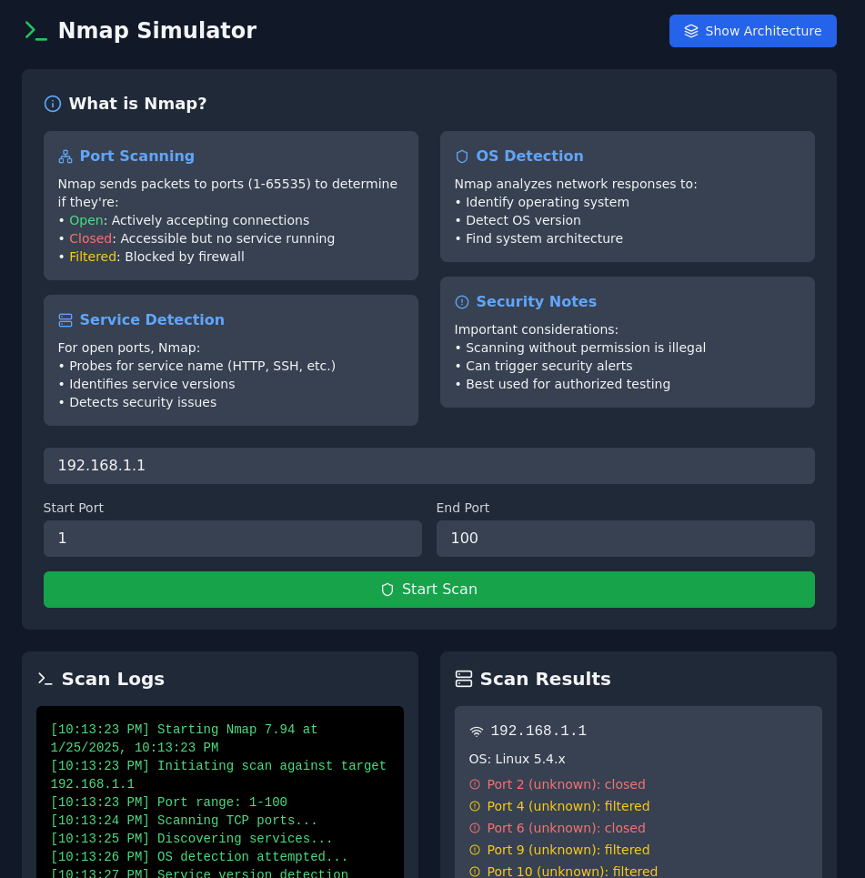

# Nmap Simulator

[](https://opensource.org/licenses/Apache-2.0)  [](https://reactjs.org/)  [](https://www.typescriptlang.org/)  [](https://vitejs.dev/)  [](https://tailwindcss.com/)

Interactive web application that simulates the functionality of the Nmap network scanning tool.

## Features

- **Port Scanning Simulation**: Simulate scanning of any port range (1-65535)
- **Real-time Logging**: View detailed scan logs as they happen
- **Service Detection**: Identify common services on standard ports
- **Multiple Port States**: Visualize open, closed, and filtered ports
- **Interactive UI**: Modern, responsive interface with dark mode
- **Educational Content**: Learn about Nmap's architecture and functionality



## Getting Started

### Prerequisites

- Node.js (v18 or higher)
- npm or yarn

### Installation

1. Clone the repository:

```bash
git clone https://github.com/yourusername/nmap-simulator.git
cd nmap-simulator
```

2. Install dependencies:

```bash
npm install
```

3. Start the development server:

```bash
npm run dev
```

## Usage

1. Enter a target IP address in the input field
2. Specify the port range you want to scan:
   - Start Port (1-65535)
   - End Port (1-65535)
3. Click "Start Scan" to begin the simulation
4. Watch the real-time logs and results appear
5. Toggle the architecture view to learn about Nmap's internal structure

## Technical Details

### Built With

- React 18
- TypeScript
- Tailwind CSS
- Lucide React Icons
- Vite

### Project Structure

```
nmap-simulator/
├── src/
│   ├── App.tsx          # Main application component
│   ├── main.tsx         # Application entry point
│   └── index.css        # Global styles
├── public/
│   └── vite.svg         # Vite logo
└── package.json         # Project dependencies
```

### Features in Detail

#### Port Scanning

- Simulates TCP port scanning
- Supports full port range (1-65535)
- Identifies common services on standard ports
- Shows port states: open, closed, filtered

#### Real-time Logging

- Detailed scan progress information
- Timestamp for each log entry
- Service discovery notifications
- OS detection simulation

#### Architecture View

- Core Engine explanation
- Network Stack details
- NSE (Nmap Scripting Engine) overview
- Data flow visualization

## Educational Purpose

This simulator is designed for educational purposes to help users understand:

- How Nmap works
- Network port scanning concepts
- Service detection methods
- Network security principles

## Security Note

Remember that in real-world scenarios:

- Port scanning without permission is illegal
- Always obtain authorization before scanning networks
- Use tools like Nmap responsibly and ethically

## Creator

Ed Bates (TECHBLIP LLC)

## Acknowledgments

Some sections of this code were generated with the assistance of AI tools.   These contributions were reviewed and integrated by the project creator(s).

## License

Apache-2.0 License - see the [LICENSE](LICENSE) file for details
